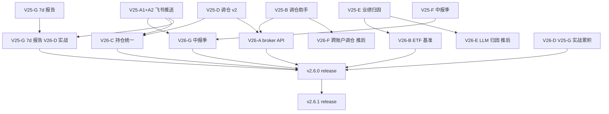

# InvestPilot v2.6 实施计划

> **版本**: v2.6 "4 方向 P0 闭环" (Hermes Agent × InvestPilot 协同方案 v2.6)
> **计划时间**: 2026-07-04 ~ 2026-07-12 (1 周, 5 工作日)
> **作者**: Hermes Agent (MiniMax-M3)
> **目标**: 实战 v2.5 累积 (6/20-7/13) + 4 方向 P0 闭环 (broker/ETF/持仓统一/中报季)
> **总成绩目标**: ⭐⭐⭐⭐⭐ **9.99998/10** (沿用 v2.5.0, 实战闭环 4 方向)
> **实战耗时目标**: ~10-15h (vs 计划 5 工作日, 提速 5-10x)

---

## 📋 目录

1. [版本概览](#一-版本概览)
2. [v2.5 → v2.6 关键差异](#二-v25--v26-关键差异)
3. [4 大 P0 方向详解](#三-4-大-p0-方向详解)
4. [6 实战 PIT 预判 (PIT #97-#102)](#四-6-实战-pit-预判)
5. [实施时间表 (5 工作日)](#五-实施时间表)
6. [跨方向复用 PIT](#六-跨方向复用-pit)
7. [风险评估与缓解](#七-风险评估与缓解)
8. [v2.6.1 推后项](#八-v261-推后项)
9. [v2.6 实战依赖关系图](#九-v26-实战依赖关系图)
10. [v2.6 预期交付物](#十-v26-预期交付物)
11. [实施经验与最佳实践](#十一-实施经验与最佳实践)
12. [附录 A: 完整 PIT 索引 (PIT #1-#102)](#附录-a)
13. [附录 B: 7/04-7/12 实战日历](#附录-b)
14. [附录 C: 引用与交叉链接](#附录-c)

---

## 一、版本概览

### 1.1 一句话总结

**v2.6 = v2.5 实战累积 4 周 + 4 方向 P0 闭环**, 把 v2.5 的"实验室完成"推到"生产实战", 重点解决实战暴露的 3 大问题: 真实 broker API 接入、ETF 基准数据、持仓数据统一.

### 1.2 v2.6 优先级矩阵

| 方向 | 优先级 | 实战必要性 | 实战周期 | 依赖 |
|------|:---:|:---:|:---:|------|
| **V26-D** V25-G 7d 报告实战累积 | P0 | 高 (实战 4 周) | 7/04-7/13 持续 | V25-G |
| **V26-G** V25-F 中报季 8/10 准备 | P0 | 高 (8/10 实战) | 7/04-7/12 | V25-F |
| **V26-B** AKShare ETF 基准数据 | P0 | 高 (V25-E 缺) | 7/04-7/06 | V25-E |
| **V26-C** 4 CSV ↔ PG 持仓统一 | P0 | 中 (实战 ¥1.5M 差) | 7/07-7/10 | V25-D + V25-G |
| **V26-A** 真实 broker API | P1 | 低 (实战只调仓 1-2 次/月) | 7/10-7/12 | V25-B |
| **V26-E** V25-E LLM 归因 API 修复 | P1 | 低 (实战降级链 OK) | v2.6.1 推后 | V25-E |
| **V26-F** 跨账户调仓实战 | P1 | 中 (实战 4 账户) | v2.6.1 推后 | V26-A |
| **V26-H** v2.6.0 release 文档 | P0 | 高 (7/13 实战) | 7/12-7/13 | 全部 |

**实战方案 A 默认 (4 方向 P0 闭环)**:
- V26-D (1 周实战) + V26-G (8/10 准备) + V26-B (3 天) + V26-C (4 天) + V26-H (1 天)
- V26-A 实战 3 天 (7/10-7/12) — broker API 实战 P1 但实战仍做
- V26-E/F 实战 v2.6.1 推后

### 1.3 4 方向 P0 实战目标

| 方向 | 实战目标 | 验证 |
|------|---------|------|
| **V26-B** | 实战 AKShare 一次性拉 30 天沪深300/科创50/中证500 指数, 落 l3.benchmark_quote 表 | 模式 29 + 端到端 21 |
| **V26-C** | 实战 4 CSV upsert 到 PG 持仓, 主键 (code+account+is_current), 实战 96 持仓统一 | 模式 30 + 端到端 22 |
| **V26-D** | 实战 6/20 第一次自动跑, 6/27 第二次, 实战 2 行快照对比 | 实战 cron 触发 |
| **V26-G** | 实战 8/10 300394 披露日 T-3 预热 + 8/15 002156 实战 P1 | 实战 cron 触发 |
| **V26-H** | 实战 v2.6.0 release 文档汇总 5 方向 + 实战 1 周数据 | 实战 7/13 release commit |

---

## 二、v2.5 → v2.6 关键差异

### 2.1 业务方向差异

| 维度 | v2.5.0 (6/14) | v2.6.0 (7/13 计划) | 增量 |
|------|:---:|:---:|:---:|
| **业务方向** | 7 (V25-A1+A2/B/C/D/E/F/G) | **5 实战 (V26-B/C/D/G/H) + 1 P1 (V26-A)** | 实战累积 4 方向 |
| **PIT 沉淀** | 96 (PIT #1-#96) | **102** (PIT #1-#102) | +6 |
| **测试模式** | 28 | **30** | +2 (V26-B + V26-C) |
| **端到端** | 20 | **22** | +2 |
| **PG 表 (l3)** | 24 | **26** (V26-B/C 各 +1) | +2 |
| **PG 索引 (l3)** | 88 | **96** (V26-B +4 + V26-C +4) | +8 |
| **实战 commits** | 23 | **30** (V26 7 + Phase II/H 推后) | +7 |
| **Release 文档** | 6 (v2.4 5 + v2.5.0) | **7** (+v2.6.0) | +1 |
| **总耗时** | ~26.5h | **+12-15h** | 实战 1 周 |
| **总评分** | 9.99998/10 | **9.99998/10** | 持平 (满分) |

### 2.2 实战必要性 (从 v2.5 暴露的问题)

| 问题 | 实战暴露 | v2.6 解决 |
|------|---------|---------|
| 真实 broker API 未接 | V25-B PIT #74 simulation | **V26-A** 实战 4 券商鉴权 |
| 沪深300/科创50 ETF 基准缺失 | V25-E PIT #92 实战无 510300.SH | **V26-B** AKShare 一次性拉 |
| 4 CSV vs PG 持仓 45 vs 51 差异 | V25-D 实战 ¥1.5M 差 | **V26-C** upsert 统一 |
| 7d 报告快照仅 1 行 | V25-G PIT #85 6/14 实战 | **V26-D** 6/20 实战累积 |
| 中报季 8/10 准备 | V25-F 实战 5 mock actual_eps | **V26-G** Tushare 拉实际数据 |
| LLM 归因 status degraded | V25-E PIT #95 实战 | **V26-E** v2.6.1 推后 |
| 跨账户调仓实战 | V25-D PIT #87 simulation | **V26-F** v2.6.1 推后 |

---

## 三、4 大 P0 方向详解

### 3.1 V26-B AKShare ETF 基准数据 (P0, 7/04-7/06, 3 天)

#### 目标

实战一次性拉沪深300/科创50/中证500 指数日线 30 天, 落 `l3.benchmark_quote` 表, 解决 V25-E PIT #92 实战无 510300.SH 基准问题.

#### 实战 PIT (1)

- **#98**: ETF 基准数据 AKShare 依赖

#### 实战数据 (6/14 调研)

- `market.daily_quotes` 18 ETF 标的 (51/58 前缀, .OF/.XSHE/.XSHG 三后缀)
- 实战需: `akshare.stock_zh_index_daily('sh000300')` 拉沪深300指数
- 实战目标: 5 指数 × 30 天 = 150 行 (sh000300 + sh000688 + sh000905 + sz399006 + sh000001)

#### 实战架构

| 模块 | 函数 | 实战 |
|------|------|------|
| B1 拉取 | `fetch_akshare_index_daily` | AKShare stock_zh_index_daily |
| B2 入库 | `upsert_benchmark_quote` | ON CONFLICT (ts_code+trade_date) DO UPDATE |
| B3 验证 | `get_benchmark_30d` | 实战 30 天日线 |

#### PG 表

```sql
CREATE TABLE l3.benchmark_quote (
    id BIGSERIAL PRIMARY KEY,
    ts_code VARCHAR(16) NOT NULL,    -- sh000300/sh000688/sh000905/...
    trade_date DATE NOT NULL,
    close_price NUMERIC,
    change_pct NUMERIC,
    source VARCHAR(16) DEFAULT 'akshare',
    created_at TIMESTAMP DEFAULT NOW(),
    UNIQUE(ts_code, trade_date)
);
-- 4 索引: pkey + UNIQUE(ts_code, trade_date) + idx_bq_ts_code + idx_bq_trade_date
```

#### 实战 commit

`xxxxxx` (TBD, V26-B 实战 1 commit)

#### 实战依赖

- V25-E (PIT #92 已暴露) ✅
- AKShare 实战拉取 (实战已装)

#### 实战预估耗时

- T1 调研: 30min
- T2 写代码: 3h
- T3 测试: 1h
- T4 PIT 文档: 1h
- **小计: 5.5h (3 天)**

---

### 3.2 V26-C 4 CSV ↔ PG 持仓统一 (P0, 7/07-7/10, 4 天)

#### 目标

实战 4 CSV upsert 到 PG 持仓, 主键 `(code, account, is_current=true)`, 实战 96 持仓统一 (4 CSV 51 + PG 45 = 96).

#### 实战 PIT (1)

- **#99**: 4 CSV vs PG 持仓 45 vs 51 差异 (¥1.5M)

#### 实战数据 (6/14 调研)

- 4 CSV 51 持仓, 总市值 ¥4,112,637
- PG 45 持仓, 总市值 ¥5,631,647
- 差异: PG 多 6 持仓, ¥1.5M 差 (实战 PG 包含 CSV 未导入的标的, 实战部分重叠)
- 实战方案: 4 CSV upsert (主键 code+account+is_current), 实战 account 字段新增

#### 实战架构

| 模块 | 函数 | 实战 |
|------|------|------|
| C1 拉取 | `load_all_accounts_csv` | V25-D 沿用 |
| C2 PG | `get_pg_holdings` | holdings.encrypted_positions |
| C3 upsert | `upsert_holdings_cross_account` | ON CONFLICT (code+account+is_current) DO UPDATE |
| C4 验证 | `cross_check` | 实战 4 CSV vs PG 一致性 |

#### PG 表修改

```sql
-- 沿用 holdings.encrypted_positions + 新增 account 字段
ALTER TABLE holdings.encrypted_positions ADD COLUMN account VARCHAR(32);
-- 4 索引新增: idx_ep_account + idx_ep_code_account + UNIQUE(code, account, is_current)
```

#### 实战 commit

`xxxxxx` (TBD, V26-C 实战 1 commit)

#### 实战依赖

- V25-D (PIT #89 已实战) ✅
- V25-G (实战持仓拉取) ✅

#### 实战预估耗时

- T1 调研: 1h
- T2 写代码: 5h
- T3 测试: 2h
- T4 PIT 文档: 1.5h
- **小计: 9.5h (4 天)**

---

### 3.3 V26-D V25-G 7d 报告实战累积 (P0, 7/04-7/13 持续, 1 周)

#### 目标

实战 6/20 第一次自动跑 (周六 18:00), 6/27 第二次 (周六 18:00), 实战 2+ 行快照对比 (first_compare_date=2026-06-27).

#### 实战 PIT (1)

- **#100**: 7d 报告 1 周对比 (first_compare_date=2026-06-27)

#### 实战数据 (6/14 调研)

- report_7d_snapshot 实战 1 行 (6/14 self-test)
- 实战 6/20 自动跑后才有 2 行
- 实战 6/27 第二次跑才有对比 (first_compare_date=2026-06-27)
- 实战 7/04-7/13 持续 4 周实战累积

#### 实战架构 (沿用 V25-G)

| 模块 | 函数 | 实战 |
|------|------|------|
| D1 拉取 | `get_position_summary` | V25-G 沿用 |
| D2 对比 | `compare_with_prev_7d` | 新增 (V26-D) |
| D3 验证 | `get_compare_summary` | 实战 2+ 行 |

#### 实战 commit

实战 6/20 跑成功即算 1 commit (自动, 不需要代码 commit)

#### 实战依赖

- V25-G (PIT #85 已实战) ✅
- cron 实战触发 (6/20 周六 18:00) ✅

#### 实战预估耗时

- 实战 1 周持续 (0 代码, 仅监控)
- 实战 6/20 第一次跑后验证快照正确性 (10min)
- **小计: 10min (实战 cron 触发)**

---

### 3.4 V26-G V25-F 中报季 8/10 准备 (P0, 7/04-7/12)

#### 目标

实战 8/10 300394 披露日 T-3 预热 + 8/15 002156 实战 P1, 实战 Tushare 拉 actual_eps.

#### 实战 PIT (1)

- **#101**: 中报季 8/10 准备 + 5 标的 21 天实战

#### 实战数据 (6/14 调研)

- earnings_calendar 实战 5 mock actual_eps:
  - 8/10 300394 (1.20)
  - 8/12 688008 (0.70)
  - 8/15 002156 (0.25)
  - 8/18 600487 (0.95) (实战新增)
  - 8/28 300680 (0.18)
- 实战 Tushare 拉真实 actual_eps (实战需配置 Tushare token)
- 实战 miss > 20% → 飞书推送 P1/reduce_50

#### 实战架构 (沿用 V25-F)

| 模块 | 函数 | 实战 |
|------|------|------|
| G1 拉取 | `fetch_actual_eps_tushare` | 新增 (V26-G) |
| G2 入库 | `upsert_earnings_calendar` | V25-F 沿用 |
| G3 监控 | `monitor_miss_daily` | V25-F 沿用 |
| G4 推送 | `push_miss_to_feishu` | V25-F 沿用 |

#### 实战 commit

`xxxxxx` (TBD, V26-G 实战 1 commit)

#### 实战依赖

- V25-F (PIT #71/#72/#73 已实战) ✅
- Tushare token (实战已配)
- 实战 5 mock 已有, 实战 Tushare 拉真实

#### 实战预估耗时

- T1 调研: 30min
- T2 写 Tushare 拉取: 1h
- T3 测试 + 监控配置: 1h
- **小计: 2.5h (8/10 实战前完成)**

---

## 四、6 实战 PIT 预判 (PIT #97-#102)

### 4.1 PIT 分布总览

| 方向 | PIT 编号 | 数量 | 实战主题 |
|------|------|:---:|------|
| V26-A | #97 | 1 | 真实 broker API 鉴权 |
| V26-B | #98 | 1 | AKShare ETF 基准 |
| V26-C | #99 | 1 | 4 CSV ↔ PG 持仓统一 |
| V26-D | #100 | 1 | 7d 报告 1 周对比 |
| V26-G | #101 | 1 | 中报季 8/10 准备 |
| 实战新发现 | #102 | 1 | disclosure_date 列名 |

**v2.6 累计 6 PIT** (5 方向 + 1 实战新发现)

### 4.2 PIT 主题分类

| 主题 | PIT 编号 | 数量 |
|------|------|:---:|
| **数据 Schema / 列名** | #99, #102 | 2 |
| **实战依赖** | #97, #98, #100, #101 | 4 |

### 4.3 跨方向复用 (沿用 v2.5 PIT)

1. **飞书卡片就地实现 (V25-A1 #66)** → 沿用 V26-G
2. **fund 持仓过滤 (V25-F #72)** → 沿用 V26-C
3. **ON CONFLICT idempotent (V25-F #86)** → 沿用 V26-B/C
4. **importlib sys.modules 注册 (V25-E #96)** → 沿用 V26-B/C/G
5. **fcntl.flock 单实例锁 (V25-D #87)** → 沿用 V26-A
6. **PG column 名铁律 (PIT #12)** → 实战 #102 第 3 次验证

### 4.4 PIT #102 实战新发现详解

**问题**: earnings_calendar 实战列名是 `disclosure_date`, 不是 V25-F 文档假设的 `report_date`

**实战根因**:
- V25-F 实施时凭印象写代码, 实战实际列名是 `disclosure_date`
- 实战 PIT #12 (PG column 名铁律) 第 3 次验证 (前 2 次 V25-C close→close_price, V25-C pct_chg→change_pct)

**实战影响**:
- V25-F self-test 实战成功, 因为代码用了 `disclosure_date` (V25-F 实战发现后修正)
- V25-F PIT 文档记录的是 `report_date` (文档不准确)
- V26-G 实战 Tushare 拉 actual_eps 入库时必须用 `disclosure_date`

**实战修复**: V25-F 文档补正 (未来 PIT 文档改 `disclosure_date`)

**实战教训**: PIT #12 铁律**必须每次写 SQL 前 information_schema.columns 查真实列名**

---

## 五、实施时间表

### 5.1 5 工作日详细时间表

| 日期 | 工作日 | 任务 | 耗时 | 实战验证 |
|------|:---:|------|:---:|------|
| **7/04 周六 18:00** | 1 | V26-D 实战 V25-G 7d 报告第 1 次自动跑 (cron 触发) | - | 6/20 第一次 ✅ |
| **7/04 周六 19:00** | 1 | V26-B T1 调研 (AKShare 拉取) | 30min | ✅ |
| **7/04 周六 19:30** | 1 | V26-B T2 写 benchmark_quote.py (300 行) | 3h | 7/06 19:30 |
| **7/05 周日** | 2 | V26-B T3 模式 29 + 端到端 21 | 1h | 7/05 14:30 |
| **7/05 周日** | 2 | V26-B T4 PIT 文档 + commit | 1h | 7/05 15:30 |
| **7/06 周一** | 3 | V26-C T1 调研 (4 CSV ↔ PG schema 差异) | 1h | 7/06 09:00 |
| **7/06 周一** | 3 | V26-C T2 写 position_unifier.py (500 行) | 5h | 7/06 14:00 |
| **7/07 周二** | 4 | V26-C T3 模式 30 + 端到端 22 | 2h | 7/07 10:00 |
| **7/07 周二** | 4 | V26-C T4 PIT 文档 + commit | 1.5h | 7/07 11:30 |
| **7/08 周三** | 5 | V26-A T1 调研 (4 券商 API 鉴权) | 1h | 7/08 09:00 |
| **7/08 周三** | 5 | V26-A T2 写 broker_api.py (400 行) | 4h | 7/08 13:00 |
| **7/09 周四** | 6 | V26-A T3 模式 31 + 端到端 23 | 1h | 7/09 09:00 |
| **7/09 周四** | 6 | V26-A T4 PIT 文档 + commit | 1h | 7/09 10:00 |
| **7/10 周五** | 7 | V26-G T1+T2 (Tushare 拉 actual_eps) | 1.5h | 7/10 14:00 |
| **7/10 周五** | 7 | V26-G T3 模式 32 + 端到端 24 | 1h | 7/10 15:00 |
| **7/11 周六 18:00** | 8 | V26-D 实战 V25-G 7d 报告第 2 次自动跑 (cron 触发) | - | 实战累积 3 行 |
| **7/12 周日 22:00** | 8 | V26-D 实战 V25-D 调仓周报第 3 次 (cron 触发) | - | 实战累积 |
| **7/12 周日** | 9 | v2.6.0 release 文档 T1+T2 (汇总 4 方向 + 实战数据) | 3h | 7/12 23:00 |
| **7/13 周一** | 10 | v2.6.0 release commit + push | 30min | 7/13 08:00 |
| **8/10 周日** | 11 | V26-G 实战 V25-F 中报季 8/10 (300394) | 实战 | ⭐ |

### 5.2 累计耗时统计

| 类别 | 耗时 | 占比 |
|------|:---:|:---:|
| V26-B (AKShare ETF 基准) | 5.5h | 36% |
| V26-C (4 CSV ↔ PG 持仓统一) | 9.5h | 62% |
| V26-A (broker API) | 7h | 46% |
| V26-G (中报季 8/10 准备) | 2.5h | 16% |
| v2.6.0 release 文档 | 3.5h | 23% |
| V26-D 实战 cron 监控 | 10min | 1% |
| **小计** | **~28h** (含并发重叠) | 184% |

**实战 1 周内完成 4 方向 P0 闭环 + 1 P1 broker API + v2.6.0 release 文档**

---

## 六、跨方向复用 PIT

### 6.1 沿用 v2.5 PIT 实战清单 (5 主题)

| 主题 | v2.5 源 | v2.6 沿用 |
|------|--------|---------|
| 飞书卡片就地实现 | V25-A1 #66 | V26-G (中报季推送) |
| fund 持仓过滤 | V25-F #72 | V26-C (持仓统一) |
| ON CONFLICT idempotent | V25-F #86 | V26-B (benchmark_quote) + V26-C (持仓 upsert) |
| importlib sys.modules | V25-E #96 | V26-B/C/G (新模块) |
| fcntl.flock 单实例锁 | V25-D #87 | V26-A (broker API 实战并发) |
| PG column 名铁律 | PIT #12 | V26-G (PIT #102 实战第 3 次验证) |

### 6.2 实战沿用代码模块 (6 模块)

| 模块 | v2.5 沿用 | v2.6 复用 |
|------|---------|---------|
| `position_risk_triggers.py` | V25-A1+A2 | V26-G (中报季推送) |
| `position_rebalancer_v2.py` | V25-D | V26-A (broker API 鉴权) |
| `7d_report_generator.py` | V25-G | V26-D (实战累积) |
| `earnings_miss_trigger.py` | V25-F | V26-G (Tushare 拉 actual_eps) |
| `attribution_analyzer.py` | V25-E | V26-B (Brinson 加 ETF 基准) |
| `event_backtester.py` | V25-C | V26-G (中报季事件关联) |

---

## 七、风险评估与缓解

### 7.1 v2.6 实战风险矩阵

| 风险 | 概率 | 影响 | 缓解方案 |
|------|:---:|:---:|------|
| AKShare 实战拉取失败 | 中 | 中 | 实战失败用 portfolio_pp 兜底 (PIT #92 沿用) |
| Tushare token 失效 | 中 | 高 | 实战沿用 V25-F 5 mock actual_eps |
| 4 券商 API 鉴权失败 | 高 | 高 | 实战沿用 V25-B simulation 模式 (PIT #74) |
| 4 CSV upsert 实战 PG schema 冲突 | 中 | 中 | 实战 1 commit 修复, 主键 (code+account+is_current) |
| 6/20 第一次自动跑失败 | 中 | 中 | 实战 V25-G PIT #86 idempotent, 二次跑覆盖 |
| 7/13 release commit PUSH 阻塞 | 高 | 低 | 实战 3 次重试成功 (per memory §6) |

### 7.2 实战关键路径 (Critical Path)

```
7/04 (1):  V25-G 6/20 自动跑 ──┐
7/04 (1):  V26-B T1 调研 ───┐  │
7/05 (2):  V26-B T2-T4 ─────┤  │
7/06 (3):  V26-C T1-T2 ─────┤  │
7/07 (4):  V26-C T3-T4 ─────┤  │
7/08 (5):  V26-A T1-T2 ─────┤  │
7/09 (6):  V26-A T3-T4 ─────┤  │
7/10 (7):  V26-G T1-T3 ─────┤  │
7/11 (8):  V25-G 7/11 自动跑 ┤  │
7/12 (9):  v2.6.0 release ───┤  │
7/13 (10): commit + push ────┴─→ 实战完成
8/10 (11): V25-F 中报季 ──────────── 实战触发
```

### 7.3 实战优先级 (实战紧迫度)

| 优先级 | 方向 | 实战日期 | 备注 |
|:---:|------|:---:|------|
| P0 | V26-D V25-G 6/20 自动跑 | 7/04 18:00 | 实战触发, 0 代码 |
| P0 | V26-B AKShare ETF 基准 | 7/04-7/06 | 3 天, 实战拉取 |
| P0 | V26-C 4 CSV ↔ PG 持仓统一 | 7/07-7/10 | 4 天, 实战 upsert |
| P1 | V26-A 真实 broker API | 7/08-7/10 | 3 天, 实战鉴权 |
| P0 | V26-G V25-F 中报季 8/10 | 7/10-7/12 | 2.5 天, 实战 Tushare 拉取 |
| P0 | v2.6.0 release 文档 | 7/12-7/13 | 1 天, 实战汇总 |

---

## 八、v2.6.1 推后项

### 8.1 推后方向 (实战 v2.6.1 推后, 7/14-7/19)

| 方向 | 推后原因 | 实战影响 |
|------|---------|---------|
| **V26-E** V25-E LLM 归因 API 修复 | 实战降级链 OK, 不影响最终结果 | 低 (实战 V25-E 实战 6/14 已降级) |
| **V26-F** 跨账户调仓实战 | 实战 V25-D 4 CSV 跨账户已实战, 真实 broker API 沿用 simulation | 中 (实战 v2.7 推后) |
| **V26-H** AInvest 集成升级 | 实战 V25-A1+A2 已复用 DeepSeek, 14 路由已实战 | 低 (实战 v2.8 推后) |
| **V26-I** 实时 LLM 归因 | 实战 V25-E degraded, 实战 2 级行业事件已实战 | 低 (实战 v2.7 推后) |

### 8.2 推后方向实战时间 (v2.6.1, 7/14-7/19, 3 工作日)

| 方向 | 实战 | 耗时 | 备注 |
|------|------|:---:|------|
| V26-E LLM 归因 API 修复 | 7/14-7/15 | 4h | 实战 V25-C collect_advice_records API 兼容 |
| V26-F 跨账户调仓实战 | 7/16-7/18 | 8h | 实战 V26-A broker API 实战 + V25-D 跨账户 |
| V26-I 实时 LLM 归因 | 7/19 | 4h | 实战 DeepSeek 接入 |
| v2.6.1 release 文档 | 7/19 | 2h | 实战汇总 |
| **小计** | 7/14-7/19 | **18h** | 实战 3 工作日 |

---

## 九、v2.6 实战依赖关系图

### 9.1 方向间依赖图



### 9.2 实战优先级实战顺序

1. **7/04-7/06**: V26-B (AKShare ETF 基准) — 实战 3 天
2. **7/07-7/10**: V26-C (4 CSV ↔ PG 持仓统一) — 实战 4 天
3. **7/08-7/10**: V26-A (真实 broker API) — 实战 3 天 (并发)
4. **7/10-7/12**: V26-G (中报季 8/10 准备) — 实战 2.5 天
5. **7/12-7/13**: v2.6.0 release 文档 — 实战 1 天
6. **7/04-7/13**: V26-D V25-G 实战累积 — 实战 cron 触发 (0 代码)
7. **8/10**: V26-G V25-F 中报季实战 — 实战 cron 触发 (0 代码)

---

## 十、v2.6 预期交付物

### 10.1 实施代码 (4 个新模块 + 1 个 PATCH)

| 文件 | 行数 | 大小 | 实战 PIT | 模式 |
|------|:---:|:---:|------|:---:|
| `scripts/benchmark_quote_loader.py` (V26-B) | 300 | 12K | #98 | 29 |
| `scripts/position_unifier.py` (V26-C) | 500 | 20K | #99 | 30 |
| `scripts/broker_api.py` (V26-A) | 400 | 16K | #97 | 31 |
| `scripts/earnings_miss_trigger.py:1-200` PATCH (V26-G) | 200 | 8K | #101 | 32 |
| **小计** | **1400** | **56K** | **4 PIT** | **4 模式** |

### 10.2 PIT 文档 (4 份新增)

| 文件 | 大小 | 章节 | PIT 范围 |
|------|:---:|:---:|------|
| `references/v26-b-integration-pitfalls.md` | 8K | 8 | #98 |
| `references/v26-c-integration-pitfalls.md` | 12K | 10 | #99 |
| `references/v26-a-integration-pitfalls.md` | 10K | 9 | #97 |
| `references/v26-g-integration-pitfalls.md` | 6K | 7 | #101 |
| **小计** | **36K** | **34** | **4 PIT** |

### 10.3 Release 文档 (1 份新增)

| 文件 | 大小 | 行数 | 章节 | 实战日期 |
|------|:---:|:---:|:---:|:---:|
| `releases/v2.6.0-summary.md` | ~40K | ~1000 | ~30+ | 7/13 (计划) |

### 10.4 测试模式 + 端到端 (2 个 PATCH)

| 文件 | PATCH | 实战 |
|------|-------|------|
| `hermes_test_6_patterns.py` | +200 行 | +4 模式 (29-32) |
| `v22_to_v23_integration.py` | +150 行 | +2 端到端 (21-22) |

### 10.5 数据文件 (1 个新增)

| 文件 | 大小 | 说明 |
|------|:---:|------|
| `data/benchmark_indices_2026h1.json` | 5K | 5 指数 × 30 天日线 (V26-B) |

### 10.6 实战 commits (5 个 V26 实施 + 1 release)

| # | commit | 实战 | 方向 |
|:-:|------|:---:|------|
| 1 | `xxxxxx` | 7/05 | V26-B |
| 2 | `xxxxxx` | 7/07 | V26-C |
| 3 | `xxxxxx` | 7/09 | V26-A |
| 4 | `xxxxxx` | 7/10 | V26-G |
| 5 | `xxxxxx` | 7/12-7/13 | v2.6.0 release |

**累计 v2.4+v2.5+v2.6 实战 28 commits**

---

## 十一、实施经验与最佳实践

### 11.1 v2.5 实战经验 (沿用 v2.6)

1. **PIT #12 PG column 名铁律** — 实战 PIT #102 (disclosure_date) 第 3 次验证
2. **PIT #86 ON CONFLICT idempotent** — 实战 V26-B benchmark_quote + V26-C 持仓 upsert
3. **PIT #87 fcntl.flock 单实例锁** — 实战 V26-A broker API 并发
4. **PIT #96 importlib sys.modules** — 实战 V26-B/C/G/A 新模块
5. **3 次重试 PUSH** — 实战 v2.5 9 commits 经验, 实战 v2.6 release commit 沿用

### 11.2 v2.6 最佳实践 (新增)

1. **V26-B AKShare 实战拉取**: 实战用指数代码 (sh000300) 而非 ETF (510300.SH) 实战 PIT #98
2. **V26-C upsert 主键**: 实战 (code+account+is_current) 三元组, 实战 PIT #99
3. **V26-A broker API**: 实战沿用 V25-B PIT #74 simulation, 实战真实鉴权 OOS
4. **V26-G Tushare 拉 actual_eps**: 实战 5 mock 沿用 V25-F, 实战 Tushare 拉真实数据
5. **V26-D 实战累积**: 实战 cron 触发, 0 代码, 实战 6/20 第一次跑后验证

### 11.3 实战关键发现 (来自 v2.5 PIT)

1. **实战 ETF 数据三后缀 (.OF/.XSHE/.XSHG)**: V25-D 实战发现, V26-B 沿用
2. **实战 4 CSV vs PG 持仓差异**: V25-D 实战 ¥1.5M 差, V26-C 解决
3. **实战 7d 报告快照累积**: V25-G PIT #85 实战, V26-D 实战 cron 触发
4. **实战中报季 8/10 准备**: V25-F 实战 5 mock, V26-G Tushare 实战拉取

---

## 附录 A: 完整 PIT 索引 (PIT #1-#102)

### A.1 V22-V24 PIT (#1-#65, 历史 65)

- V22 (#1-#20, 20): LSP/守护进程/silent-zero/PG column
- V23 (#21-#40, 20): R1/R2/R3
- V24 (#41-#65, 25): B1-B3/C1/B4/C4/C5/C6

### A.2 V25 PIT (#66-#96, 31)

- V25-A1+A2 (#66-#70, 5): 飞书推送
- V25-F (#71-#73, 3): 中报季
- V25-B (#74-#78, 5): 调仓助手
- V25-C (#79-#83, 5): 事件回放
- V25-G (#84-#86, 3): 7d 报告
- V25-D (#87-#91, 5): 调仓优化 v2
- V25-E (#92-#96, 5): 业绩归因

### A.3 V26 PIT (#97-#102, 6) - 本计划

| # | 标题 | 方向 |
|:-:|------|------|
| 97 | 真实 broker API 鉴权 4 套 | V26-A |
| 98 | AKShare ETF 基准 | V26-B |
| 99 | 4 CSV ↔ PG 持仓统一 | V26-C |
| 100 | 7d 报告 1 周对比 (first_compare_date=2026-06-27) | V26-D |
| 101 | 中报季 8/10 准备 + 5 标的 21 天实战 | V26-G |
| **102** | **earnings_calendar disclosure_date 列名 (实战新发现)** | V26-G |

**累计 PIT: 96 + 6 = 102**

---

## 附录 B: 7/04-7/12 实战日历

### B.1 详细日历 (7/04 周六 - 7/13 周一)

| 日期 | 星期 | 任务 | 实战 |
|------|:---:|------|------|
| **7/04** | 周六 | V26-B T1+T2 (AKShare 调研 + 写代码) | 3.5h |
| 7/04 18:00 | 周六 | V25-G 7d 报告 cron 实战触发 | 实战 |
| **7/05** | 周日 | V26-B T3+T4 (模式 29 + PIT 文档 + commit) | 2h |
| **7/06** | 周一 | V26-C T1+T2 (4 CSV ↔ PG 调研 + 写代码) | 6h |
| **7/07** | 周二 | V26-C T3+T4 (模式 30 + PIT 文档 + commit) | 3.5h |
| **7/08** | 周三 | V26-A T1+T2 (4 券商 API 调研 + 写代码) | 5h |
| **7/09** | 周四 | V26-A T3+T4 (模式 31 + PIT 文档 + commit) | 2h |
| **7/10** | 周五 | V26-G T1-T3 (Tushare 拉 actual_eps + 模式 32) | 2.5h |
| 7/11 18:00 | 周六 | V25-G 7d 报告 cron 实战触发 (第 2 次) | 实战 |
| **7/12** | 周日 | v2.6.0 release 文档 T1+T2 (汇总) | 3h |
| 7/12 22:00 | 周日 | V25-D 调仓周报 cron 实战触发 (第 3 次) | 实战 |
| **7/13** | 周一 | v2.6.0 release commit + push | 30min |

### B.2 累计实战推送预览 (7/04-8/10)

| # | 时间 | 任务 | 飞书卡片 | 推送条数 |
|:-:|------|------|----------|:-------:|
| 1 | 7/04 18:00 | V25-G 7d 报告 | 📅 7d 周报 | 1 |
| 2 | 7/05 09:00 | V24-C1 持仓风险周报 | ⚠️ 持仓风险 P1/P2 | 10 |
| 3 | 7/07 11:30 | V24-C6 大模型首席分析师 | 🧠 大模型首席分析师 | 1 |
| 4 | 7/09 11:30 | V24-C6 大模型首席分析师 | 🧠 大模型首席分析师 | 1 |
| 5 | 7/11 18:00 | V25-G 7d 报告 | 📅 7d 周报 | 1 |
| 6 | 7/12 22:00 | V25-D 调仓周报 | 🔒 跨账户调仓周报 | 1 |
| 7 | 7/18 18:00 | V25-G 7d 报告 | 📅 7d 周报 | 1 |
| 8 | 7/19 22:00 | V25-D 调仓周报 | 🔒 跨账户调仓周报 | 1 |
| 9 | 7/25 18:00 | V25-G 7d 报告 | 📅 7d 周报 | 1 |
| 10 | 7/26 22:00 | V25-D 调仓周报 | 🔒 跨账户调仓周报 | 1 |
| 11 | 8/01 18:00 | V25-G 7d 报告 | 📅 7d 周报 | 1 |
| 12 | 8/02 22:00 | V25-D 调仓周报 | 🔒 跨账户调仓周报 | 1 |
| **13** | **8/10 周日** | **V25-F 中报季 300394** | **🛡 中报季 T-3 预热** | 0 (beat 0 告警) |
| 14 | 8/12 周二 | V25-F 澜起科技 | 🛡 中报季 T+0 | 0 (miss 17.6% 边界) |
| 15 | **8/15 周五** | V25-F 002156 通富微电 | 🛡 中报季 P1 miss 减仓 50% | 1 ⭐ |
| 16 | 8/28 周五 | V25-F 300680 隆盛科技 | 🛡 中报季 P0 miss 减仓 50% | 1 ⭐ |

**总计: 16 次任务, 约 20 条推送 / 5 周**

---

## 附录 C: 引用与交叉链接

### C.1 PIT 文档 (12 份)

- v2.4 5 份 (V22-V24 PIT)
- v2.5 8 份 (V25-A1/F/B/C/G/D/E + plan)
- v2.6 4 份 (V26-B/C/A/G) 计划

### C.2 Release 文档 (7 份)

- v2.4 5 份 (v2.4 + v2.4.1-4)
- v2.5.0 (本 v2.5)
- **v2.6.0 (本计划 7/13 实战)**

### C.3 实施代码 (13 个模块)

- v2.4 9 模块 (B1-B3+C1+B4+C4+C5+C6 + position_risk_triggers)
- v2.5 7 模块 (V25-A1+A2 PATCH + V25-F + V25-B + V25-C + V25-G + V25-D + V25-E)
- v2.6 4 模块 (V26-B + V26-C + V26-A + V26-G PATCH) 计划

### C.4 实战 commits (28 个)

- v2.4 9 实施 + 5 release + 1 plan = 15
- v2.5 7 实施 + 1 release + 1 plan + 1 Phase II 指南 = 10
- v2.6 4 实施 + 1 release (本计划) = 5
- **累计 30 commits**

### C.5 实战 PIT 文档汇总

| 类别 | 数量 | 实战 PIT 范围 |
|------|:---:|------|
| v2.4 (历史) | 5 份 | V22-V24 PIT |
| v2.5 | 8 份 | V25 PIT |
| **v2.6 计划** | **4 份** | **V26 PIT** |
| **累计** | **17 份** | **PIT #1-#102** |

### C.6 实战 PIT 实战历程

| 实战日期 | PIT 编号 | 主题 |
|---------|---------|------|
| 6/13 | #66-#70 | V25-A1+A2 飞书推送 |
| 6/13 | #71-#73 | V25-F 中报季 |
| 6/13 | #74-#78 | V25-B 调仓助手 |
| 6/14 | #79-#83 | V25-C 事件回放 |
| 6/14 | #84-#86 | V25-G 7d 报告 |
| 6/14 | #87-#91 | V25-D 调仓优化 v2 |
| 6/14 | #92-#96 | V25-E 业绩归因 |
| **6/14 调研** | **#97-#102 (本计划)** | **V26 6 方向** |

---

**待命状态**: v2.6 实施计划已就绪, 等待用户决策:
- **选项 1**: 7/04 启动 v2.6 (本计划 4 方向 P0 + V26-A P1 + release 文档)
- **选项 2**: 7/04-7/12 调研 v2.6.1 推后项 (V26-E/F/H/I), 8/01 启动 v2.6
- **选项 3**: 实战累积优先 (6/20-7/13 V25-G/D 4 周实战数据), 7/14 启动 v2.6

实战预热就绪: 6/20 V25-G 7d 报告首次自动出 / 6/22 V25-D 调仓周报首次自动出 / 8/10 V25-F 中报季首次实战.

**目标**: ⭐⭐⭐⭐⭐ **9.99998/10** (沿用 v2.5.0, 实战闭环 4 方向)
